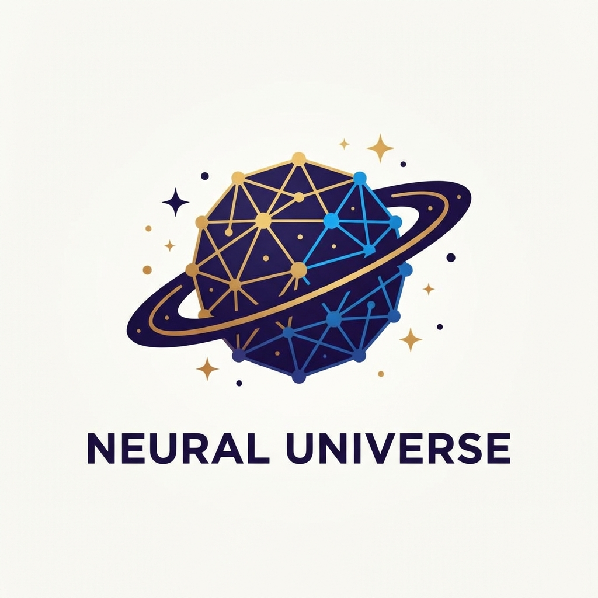

# Neural Universe - AI Role-Playing Platform

<div align="center">
  
  <br/>
  <h3>Next-Gen Immersive AI Role-Playing System</h3>
  <p>
    Built with <strong>Vue 3</strong> + <strong>Express</strong> + <strong>MongoDB</strong><br/>
    Powered by Multi-Modal Large Language Models (Qwen-VL)
  </p>
</div>

## 📖 Introduction
**Neural Universe** is a full-stack AI role-playing platform that goes beyond simple text chat. It integrates visual perception, real-time streaming responses, and persistent memory to create lifelike digital personas. 

Whether you want to chat with a cyberpunk hacker or a fantasy mage, Neural Universe provides the immersive environment to make it happen.

## ✨ Key Features
- **🧠 Multi-Modal Interaction**: Send images to the AI! The system uses Qwen-VL to verify and understand visual content in real-time.
- **⚡ Streaming Responses**: Server-Sent Events (SSE) deliver type-writer style responses instantly, no waiting for the full generation.
- **🎨 Modern UI/UX**: Glassmorphism design, dark mode, and responsive layout built with Vue 3 & CSS variables.
- **💾 Persistent Memory**: Roles and chat history are stored in MongoDB, so your conversations are never lost.
- **🖼️ Client-Side Optimization**: Smart image compression (Canvas API) reduces upload bandwidth while maintaining AI-readable quality.

## 🛠️ Tech Stack

### Frontend
- **Framework**: Vue 3 (Composition API, `<script setup>`)
- **State Management**: Pinia (TypeScript support)
- **Build Tool**: Vite
- **Styling**: Native CSS Variables (Themed)

### Backend
- **Runtime**: Node.js
- **Framework**: Express.js
- **Database**: MongoDB (Mongoose Schema)
- **AI Integration**: OpenAI-compatible SDK (Dashscope/Qwen)
- **File Storage**: Local filesystem with Multer

## 🚀 Getting Started

### Prerequisites
- Node.js (v16+)
- MongoDB (Running locally or Atlas URI)

### Installation

1. **Clone the repository**
   ```bash
   git clone https://github.com/lizuyi-6/aicosplay.git
   cd aicosplay
   ```

2. **Backend Setup**
   ```bash
   cd server
   npm install
   # Configure environment variables
   cp .env.example .env
   # Edit .env and add your OPENAI_API_KEY / DASHSCOPE_API_KEY
   npm start
   ```

3. **Frontend Setup**
   ```bash
   cd client
   npm install
   npm run dev
   ```

4. **Access the App**
   Open `http://localhost:5173` in your browser.

## 📂 Project Structure
```
├── client/              # Vue 3 Frontend
│   ├── src/
│   │   ├── components/  # Atomic UI Components (ChatInput, MessageBubble)
│   │   ├── stores/      # State Management (Pinia)
│   │   └── views/       # Page Logic (ChatView, HomeView)
│
└── server/              # Express Backend
    ├── src/
    │   ├── models/      # Mongoose Schemas (Role, Message)
    │   └── routes/      # API Routes (chat, upload)
    └── uploads/         # Image storage
```

## 🛡️ Architecture Highlights
- **SSE vs WebSocket**: We chose **SSE** for text generation because it's lighter, auto-reconnects, and perfectly fits the "server-push" pattern of AI responses.
- **Secure Image Handling**: Local images are converted to **Base64** server-side for AI consumption, resolving localhost access issues for cloud models.

## 📄 License
MIT License © 2026 Neural Universe Team
